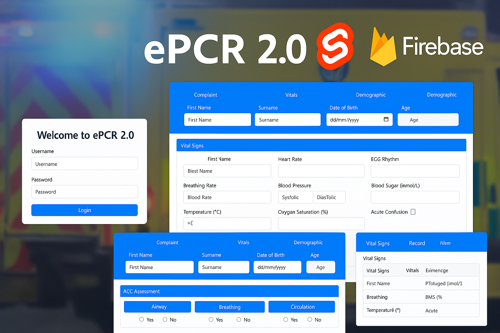

 
  

    
    
Frank Donnellan

  

 
  

    
  

  

    This is a paragraph about my project. It explains what the project does and why it's useful or interesting.
    You can <a href="https://github.com/yourusername/yourrepo" target="_blank">view the GitHub repository</a>,
    check the <a href="https://yourproject.vercel.app" target="_blank">live site on Vercel</a>,
    or <a href="https://youtu.be/yourvideoID" target="_blank">watch the demo video on YouTube</a>.
  

